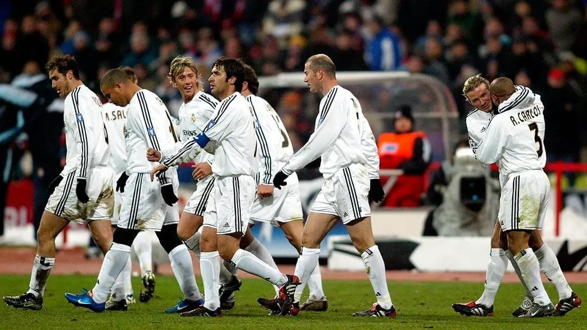

# Real Madrid All-Stars

---


Hola amigo, this project aims to provide information about the best players played for the club in the history of football.

- All the information is double-checked and stored manually. It's not just a reshape of a Kaggle database, but handpicked and sorted fine data.


Information was taken from:
- RealMadrid.com
- Transfermarkt.com


All data is kept in json format: Example:

```json
{
  "Defender": [
    {
      "name": "Cannavaro",
      "full_name": "Fabio Cannavaro",
      "country_id": "2",
      "position": "Defender",
      "number": [
        "5"
      ],
      "appearances": "106",
      "goals": "1"
    }
  ],
  "Midfielder": [
    {
      "name": "Beckham",
      "full_name": "David Robert Joseph Beckham",
      "country_id": "9",
      "position": "Midfielder",
      "number": [
        "23"
      ],
      "appearances": "159",
      "goals": "20"
    }
  ]
}
```

[](https://youtu.be/Yc-7IQqcqeM?si=MufgRRxBI-yEOEc1)

---

## Benefits of the database

- If you care about the numbers the players wore.
- Precise data, as I check every single player by myself, all data is 100% correct. For example - Emilio Butragueno, a lot of datasets don't count his friendly games as appearances, just because that is scrapped from Google/elsewhere low-quality data. Here, I manually count and update a lot of details for the best information. 
- If you want to generate reports on the best players only. 

---

Vamos Real, Hala Madrid
